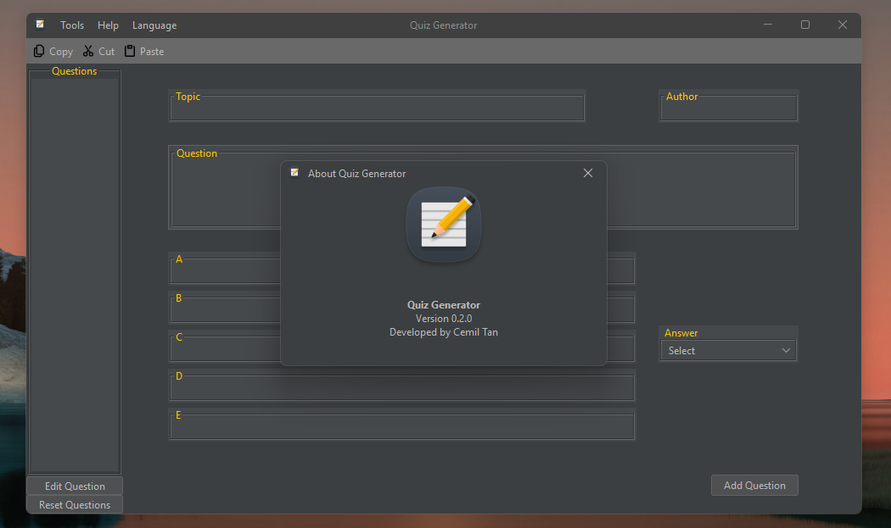
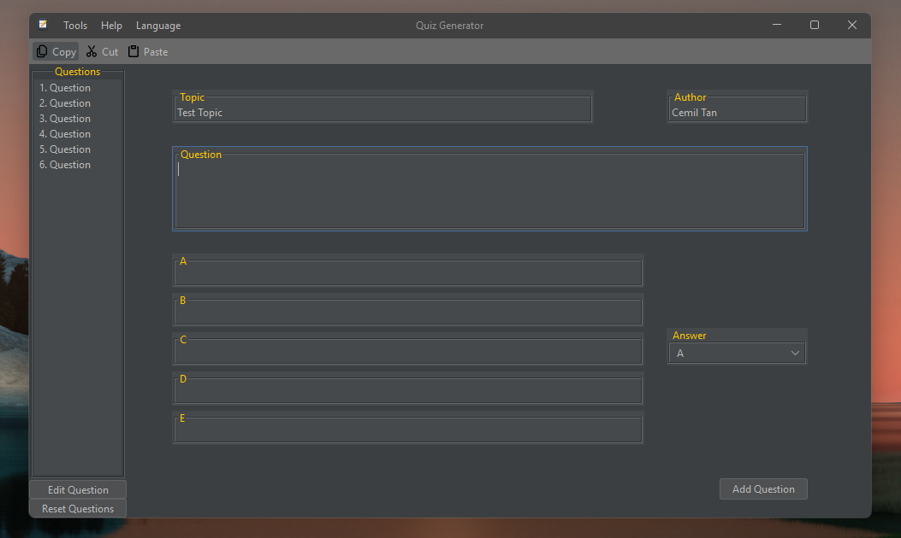
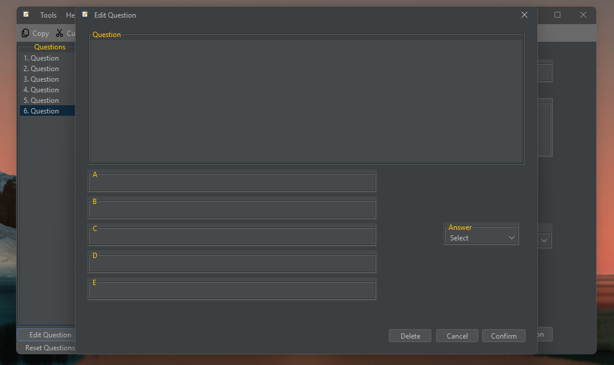

<h1 align="center">
  Quiz Generator 
  
   
   

  <br>
</h1>

<p align="center">
  <a href="#ℹ%EF%B8%8F-introduction">Introduction</a> •
  <a href="#installation-guide">Installation Guide</a> •
  <a href="#screenshots">Screenshots</a> •
  <a href="#license">License</a> •
  <a href="#contributors">Contributors</a> 
</p>

<div align="center">


</div>

## ℹ️ Introduction
- This is a simple JAVA Swing project. 
- You can generate quiz tests based on input from the user.
- You can get the output in `pdf` and `docx` format.


## 💾Installation Guide

- To clone and run this application, you'll need [Git](https://git-scm.com), [Java](https://www.java.com/en/download/help/download_options.html) installed on your computer.
From your command line:

    ```bash
    # Clone this repository
    $ git clone https://github.com/Ctere1/swing-quiz-gen
    # Go into the repository
    $ cd swing-quiz-gen
    # Run the app in Editor
    ```

> [!Tip]   
You can download and run the latest jar [release](https://github.com/Ctere1/swing-quiz-gen/releases) directly.

## 🪟Screenshots





> Now supports Turkish  


> [!Note]   
You can check the example output [here](./Test%20Topic.pdf).

## ©License


## 📌Contributors

<a href="https://github.com/Ctere1/">
  
</a>